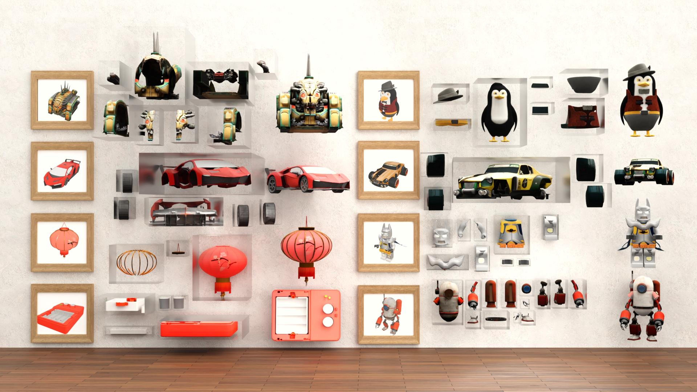

# OmniPart: Part-Aware 3D Generation with Semantic Decoupling and Structural Cohesion [SIGGRAPH Asia 2025]

<div align="center">

[](https://omnipart.github.io/)
[](https://arxiv.org/abs/2507.06165)
[](https://huggingface.co/omnipart)
[](https://huggingface.co/spaces/omnipart/OmniPart)

</div>



## 🔥 Updates

### 📅 October 2025
- Pretrained models, interactive demo, training code and data processing. 

## 🔨 Installation

Clone the repo:
```bash
git clone https://github.com/HKU-MMLab/OmniPart
cd OmniPart
```

Create a conda environment (optional):
```bash
conda create -n omnipart python=3.10
conda activate omnipart
```

Install dependencies:
```bash
pip install -r requirements.txt
```

## 💡 Usage

### Launch Demo

```bash
python app.py
```

### Inference Scripts

If running OmniPart with command lines, you need to obtain the segmentation mask of the input image first. The mask is saved as a .exr file with the shape [h, w, 3], where the last dimension contains the 2D part_id replicated across all three channels.

```bash
python -m scripts.inference_omnipart --image_input {IMAGE_PATH} --mask_input {MASK_PATH}
```

The required model weights will be automatically downloaded:
- OmniPart model from [OmniPart](https://huggingface.co/omnipart) → local directory `ckpt/`

### Training

#### Data processing

Step 1: Render multi-view images of parts and overall shapes, following [TRELLIS Step 4](https://github.com/microsoft/TRELLIS/blob/main/DATASET.md#step-4-render-multiview-images).

Step 2: Voxelize parts and overall shapes with `dataset_toolkits/voxelize_part.py` and `dataset_toolkits/voxelize_overall.py`.

Step 3: Extract DINO features of parts and overall shapes, following [TRELLIS Step 6](https://github.com/microsoft/TRELLIS/blob/main/DATASET.md#step-6-extract-dino-features).

Step 4: Encode SLat of parts and overall shapes, following [TRELLIS Step 8](https://github.com/microsoft/TRELLIS/blob/main/DATASET.md#step-8-encode-slat).

Step 5: Merge SLat of parts and overall shapes with `dataset_toolkits/merge_slat.py`.

Step 6: Render image and mask conditions with `dataset_toolkits/blender_render_img_mask.py`.

#### Training code
Fill in the values for `data_root`, `train_mesh_list`, `val_mesh_list` and `denoiser` in `configs/training_part_synthesis.json`. The `denoiser` field requires the path to a diffusion model checkpoint in `.pt` format (using `training/utils/transfer_st_pt.py`) that you wish to finetune, for example: `ckpt/slat_flow_img_dit_L_64l8p2_fp16.pt`.

```bash
python train.py --config configs/training_part_synthesis.json --output_dir {OUTPUT_PATH} --data_dir {SLat_PATH}
```

## ⭐ Acknowledgements

We would like to thank the following open-source projects and research works that made OmniPart possible:

- [TRELLIS](https://github.com/microsoft/TRELLIS)
- [PartField](https://github.com/nv-tlabs/PartField)
- [FlexiCubes](https://github.com/nv-tlabs/FlexiCubes)

We are grateful to the broader research community for their open exploration and contributions to the field of 3D generation.

## 📚 Citation

```
@article{yang2025omnipart,
        title={Omnipart: Part-aware 3d generation with semantic decoupling and structural cohesion},
        author={Yang, Yunhan and Zhou, Yufan and Guo, Yuan-Chen and Zou, Zi-Xin and Huang, Yukun and Liu, Ying-Tian and Xu, Hao and Liang, Ding and Cao, Yan-Pei and Liu, Xihui},
        journal={arXiv preprint arXiv:2507.06165},
        year={2025}
}
```
