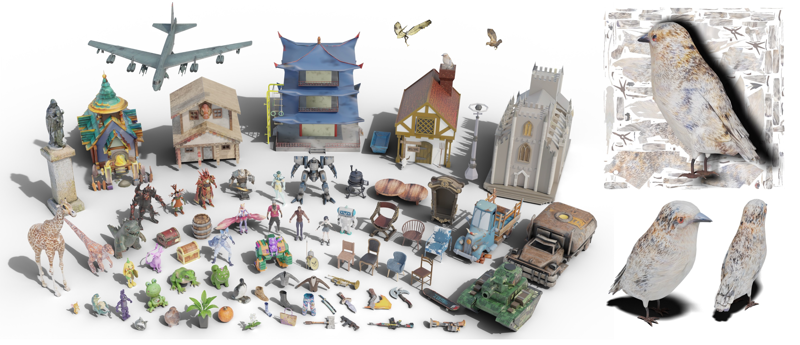

<p align="center">

  <h2 align="center">TEXGen: a Generative Diffusion Model for Mesh Textures<br>
<span style="color: #8e44ad; font-size: smaller;">(SIGGRAPH Asia 2024, Journal Track, Best Paper Honorable Mention)</span>
</h2>
  <p align="center">
    <a href="https://xinyu-andy.github.io/"><strong>Xin Yu</strong></a>
    ·
    <a href="https://yuanze.me"><strong>Ze Yuan</strong></a>
    ·
    <a href="https://scholar.google.com/citations?user=b7ZJV9oAAAAJ&hl=en"><strong>Yuan-Chen Guo</strong></a>
    ·
    <a href="https://scholar.google.com/citations?user=sjFapgUAAAAJ&hl=zh-CN"><strong>Ying-Tian Liu</strong></a>
    ·
    <a href="https://sites.google.com/view/jianhuiliu/home"><strong>JianHui Liu</strong></a>
    ·
    <a href="https://scholar.google.com/citations?user=a7AMvgkAAAAJ&hl=zh-CN"><strong>Yangguang Li</strong></a>
    ·
    <a href="https://yanpei.me"><strong>Yan-Pei Cao</strong></a>
    ·
    <a href="https://scholar.google.com/citations?user=Dqjnn0gAAAAJ&hl=zh-CN"><strong>Ding Liang</strong></a>
    ·
    <a href="https://xjqi.github.io/"><strong>Xiaojuan Qi</strong></a>
    ·
    </a>
    <br>
    <br>
        <a href="https://arxiv.org/abs/2411.14740"></a>
        <a href='https://cvmi-lab.github.io/TEXGen/'></a>
        </a>
    <br>
    <b>The University of Hong Kong &nbsp; | &nbsp;  VAST  | &nbsp;  Beihang University | &nbsp;  Tsinghua University</b>
  </p>
  <table align="center">
    <tr>
    <td>
      
    </td>
    </tr>
  </table>

TEXGen is a feed-forward texture generation model which diffuses albedo texture map directly on the UV domain.

## :rocket: :rocket: :rocket: **News**
- **[2024-12-15]**: Release the inference code.


## Requirements
The training process requires at least one GPU with VRAM bigger than 40GB. We test the whole pipeline using Nvidia A100 gpu. Other GPUs are not tested but may be fine. For testing only, a GPU with 24GB VRAM will be fine.

## Environment
#### Docker Image
For convenience, it is welcomed to use our built-up docker image to run TEXGen.
```shell
docker run -it yuanze1024/texgen_release:v1 bash 
```

#### From Scratch
Note that it could be really tricky to build an environment from scratch, so we strongly recommend you to use our docker image. You can also build your environment on your own:
```shell
apt-get install libgl1 libglib2.0-0 libsm6 libxrender1 libxext6 libssl-dev build-essential g++ libboost-all-dev libsparsehash-dev git-core perl libegl1-mesa-dev libgl1-mesa-dev -y
conda create -n texgen python=3.10 -y
conda activate texgen
conda install ninja -y
conda install -c "nvidia/label/cuda-11.8.0" cuda-toolkit -y
conda install pytorch==2.1.0 torchvision==0.16.0 pytorch-cuda=11.8 -c pytorch -c nvidia -y
conda install h5py pyyaml -c anaconda -y
conda install sharedarray tensorboard tensorboardx yapf addict einops scipy plyfile termcolor timm gxx=11.1.0 lightning -c conda-forge -y
conda install pytorch-cluster pytorch-scatter pytorch-sparse -c pyg -y
pip install -r requirements.txt
```

## Usage
We provide the example testing data in `assets/models`. You can organize your own customized data as below:
```shell
$YOUR_DATA_PATH
├── 34 # which is the first two character of the model id
│   └── 3441609f539b46b38e7ab1213660cf3e # the unique id of a 3D model
│       ├── model.mtl
│       ├── model.obj
│       └── model.png # albedo texture map
```
For the model indices input, see `assets/input_list/test_input.jsonl` for an example, where `result` represents the textual prompt.

#### Inference
For sanity checking, you can run the following code snippet.
```shell
CHECKPOINT_PATH="assets/checkpoints/texgen_v1.ckpt"
# assume single gpu
python launch.py --config configs/texgen_test.yaml --test --gpu 0 data.eval_scene_list="assets/input_list/test_input.jsonl" exp_root_dir=outputs_test name=test tag=test system.weights=$CHECKPOINT_PATH
```
The results will be put in `<exp_root_dir>/<name>/<tag>@<time>`. 

#### Model Checkpoint
You can download our [trained checkpoint](https://huggingface.co/Andyx/TEXGen/tree/main), and put it under `assets/checkpoints`. Note that the released model is trained with Flow Matching which is different from the paper version, since we find it more stable. Check this [blog](https://diffusionflow.github.io/) to understand the connection between Flow Matching and Diffusion.

During the whole process, some components (e.g. CLIP, time scheduler) from HuggingFace are required. So make sure you have the access to HF or to their checkpoints. The relevant components are listed here:
```text
lambdalabs/sd-image-variations-diffusers
stabilityai/stable-diffusion-2-depth
```

## Citation
```bib
@article{10.1145/3687909,
    author = {Yu, Xin and Yuan, Ze and Guo, Yuan-Chen and Liu, Ying-Tian and Liu, Jianhui and Li, Yangguang and Cao, Yan-Pei and Liang, Ding and Qi, Xiaojuan},
    title = {TEXGen: a Generative Diffusion Model for Mesh Textures},
    journal = {ACM Trans. Graph.},
    volume = {43},
    number = {6},
    year = {2024},
    issn = {0730-0301},
    doi = {10.1145/3687909},
    articleno = {213},
    numpages = {14},
    keywords = {generative model, texture generation}
}
```
