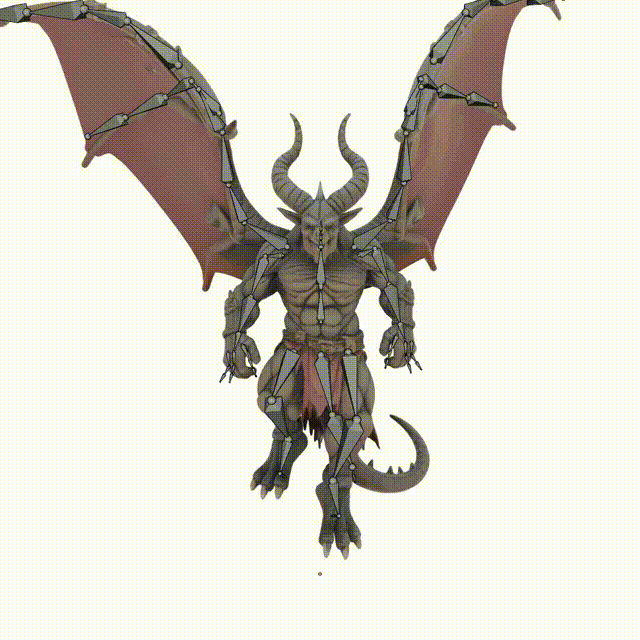
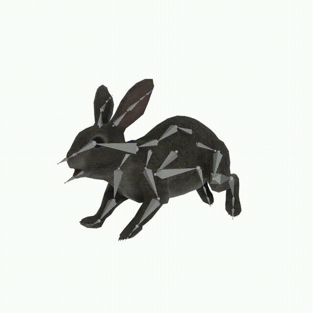
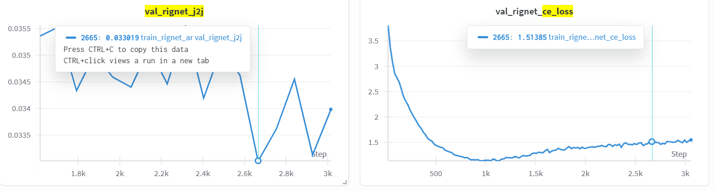

# UniRig: One Model to Rig Them All

<div align="center">

[](https://zjp-shadow.github.io/works/UniRig/)
[](https://arxiv.org/abs/2504.12451)
[](https://huggingface.co/VAST-AI/UniRig)

</div>


This repository contains the official implementation for the **SIGGRAPH'25 (TOG) UniRig** framework, a unified solution for automatic 3D model rigging, developed by Tsinghua University and [Tripo](https://www.tripo3d.ai).

**Paper:** [One Model to Rig Them All: Diverse Skeleton Rigging with UniRig](https://arxiv.org/abs/2504.12451)

## Overview

Rigging 3D models – creating a skeleton and assigning skinning weights – is a crucial but often complex and time-consuming step in 3D animation. UniRig tackles this challenge by introducing a novel, unified framework leveraging large autoregressive models to automate the process for a diverse range of 3D assets.

Combining UniRig with keyframe animation produces these following results:

|  |  |  |
|:-----------------------------:|:-------------------------------:|:-------------------------------:|

The full UniRig system consists of two main stages:
1.  **Skeleton Prediction:** An GPT-like transformer autoregressively predicts a topologically valid skeleton hierarchy using a novel **Skeleton Tree Tokenization** scheme.
2.  **Skinning Weight & Attribute Prediction:** A **Bone-Point Cross Attention** mechanism predicts per-vertex skinning weights and relevant bone attributes (e.g., for physics simulation) based on the predicted skeleton and input mesh geometry.

This repository provides the code implementation for the entire framework vision, with components being released progressively.

## Key Features (Full UniRig Framework)

*   **Unified Model:** Aims to handle diverse model categories (humans, animals, objects) with a single framework.
*   **Automated Skeleton Generation:** Predicts topologically valid skeleton structures. **(✅ Available in current release)**
*   **Automated Skinning Prediction:** Predicts per-vertex skinning weights. **(✅ Available in current release)**
*   **Bone Attribute Prediction:** Predicts attributes like stiffness for physics-based secondary motion. **(⏳ Coming Soon)**
*   **High Accuracy & Robustness:** Achieves state-of-the-art results on challenging datasets (as shown in the paper with Rig-XL/VRoid training).
*   **Efficient Tokenization:** Uses Skeleton Tree Tokenization for compact representation and efficient processing.
*   **Human-in-the-Loop Ready:** Designed to potentially support iterative refinement workflows.

## 🚨 Current Release Status & Roadmap 🚨

We are open-sourcing UniRig progressively. Please note the current status:

**Available Now (Initial Release):**
*   ✅ **Code:** Implementation for skeleton and skinning prediction.
*   ✅ **Model:** Skeleton & Skinning Prediction checkpoint trained on [**Articulation-XL2.0**](https://huggingface.co/datasets/Seed3D/Articulation-XL2.0). Available on [Hugging Face](https://huggingface.co/VAST-AI/UniRig).
*   ✅ **Dataset:** Release of the **Rig-XL** and **VRoid** datasets used in the paper. We also filtered out 31 broken models in the training dataset which do not affect the performance of the final model.
*   ✅ Training code.

**Planned Future Releases:**
*   ⏳ Full UniRig model checkpoints (Skeleton + Skinning) trained on Rig-XL/VRoid, replicating the paper's main results.

We appreciate your patience as we prepare these components for release. Follow [VAST-AI-Research](https://github.com/orgs/VAST-AI-Research) announcements for updates!

## Installation

1.  **Prerequisites:**
    *   Python 3.11
    *   PyTorch (tested with version >=2.3.1)

2.  **Clone the repository:**
    ```bash
    git clone https://github.com/VAST-AI-Research/UniRig
    cd UniRig
    ```

3.  **Set up a virtual environment (recommended):**
    ```bash
    conda create -n UniRig python=3.11
    conda activate UniRig
    ```

4.  **Install dependencies:**
    ```bash
    python -m pip install torch torchvision
    python -m pip install -r requirements.txt
    python -m pip install spconv-{you-cuda-version}
    python -m pip install torch_scatter torch_cluster -f https://data.pyg.org/whl/torch-{your-torch-version}+{your-cuda-version}.html --no-cache-dir
    python -m pip install numpy==1.26.4
    ```
  
  `spconv` is installed from [this repo](https://github.com/traveller59/spconv), `torch_scatter` and `torch_cluster` are installed from [this site](https://pytorch-geometric.readthedocs.io/en/latest/install/installation.html). Also, there is a high chance that you will encounter flash_attn installation error, go to its [original repo](https://github.com/Dao-AILab/flash-attention) and follow its installation guide.

5.  **Download Model Checkpoint:**
    The currently available skeleton prediction model checkpoint is hosted on Hugging Face and will typically be downloaded automatically by the provided scripts/functions.

6.  **(Optional, for importing/exporting .vrm) Install the blender addon:**
    The blender addon is modifed from [VRM-Addon-for-Blender](https://github.com/saturday06/VRM-Addon-for-Blender).

    Make sure you are in the root directory of the project, then:
    ```bash
    python -c "import bpy, os; bpy.ops.preferences.addon_install(filepath=os.path.abspath('blender/add-on-vrm-v2.20.77_modified.zip'))"
    ```

## RigXL Dataset

[processed data link](https://huggingface.co/VAST-AI/UniRig/tree/main/data/rigxl)

Notice that aside from vroid, all models are selected from [Objaverse](https://huggingface.co/datasets/allenai/objaverse-xl). Just download `mapping.json` if you already have Objaverse dataset (or need to download from web).

The json contains all ids of the models with `type` indicating their category and `url` specifying where to download. `url` is the same with `fileIdentifier` in Objaverse.

Training/validation split is put in `datalist` folder.

📝 **Note**:  
All floating-point values are stored in **`float16`** format for compression.

### Visualize Data

Put the dataset in `dataset_clean`, go back to root, and run the command to export FBX model:

```python
from src.data.raw_data import RawData
raw_data = RawData.load("dataset_clean/rigxl/12345/raw_data.npz")
raw_data.export_fbx("res.fbx")
```

<details>
<summary><strong>📁 Dataset Format</strong> (click to expand)</summary>

### 🔑 Keys of Data

All models are converted into world space.

- **`vertices`**:  
  Position of the vertices of the mesh, shape `(N, 3)`.

- **`vertex_normals`**:  
  Normals of the vertices, processed by `Trimesh`, shape `(N, 3)`.

- **`faces`**:  
  Indices of mesh faces (triangles), starting from 0, shape `(F, 3)`.

- **`face_normals`**:  
  Normals of the faces, shape `(F, 3)`.

- **`joints`**:  
  Positions of the armature joints, shape `(J, 3)`.

- **`skin`**:  
  Skinning weights for each vertex, shape `(N, J)`.

- **`parents`**:  
  Parent index of each joint, where `parents[0]` is always `None` (root), shape `(J)`.

- **`names`**:  
  Name of each joint.

- **`matrix_local`**:  
  The local axis of each bone; aligned to Y-up axis, consistent with Blender.

</details>

## Usage

### Skeleton Prediction

Generate a skeleton for your 3D model using our pre-trained model. The process automatically analyzes the geometry and predicts an appropriate skeletal structure.

```bash
# Process a single file
bash launch/inference/generate_skeleton.sh --input examples/giraffe.glb --output results/giraffe_skeleton.fbx

# Process multiple files in a directory
bash launch/inference/generate_skeleton.sh --input_dir <your_input_directory> --output_dir <your_output_directory>

# Try different skeleton variations by changing the random seed
bash launch/inference/generate_skeleton.sh --input examples/giraffe.glb --output results/giraffe_skeleton.fbx --seed 42
```

Supported input formats: `.obj`, `.fbx`, `.glb`, and `.vrm`

### Skinning Weight Prediction
```bash
# Skin a single file
bash launch/inference/generate_skin.sh --input examples/skeleton/giraffe.fbx --output results/giraffe_skin.fbx

# Process multiple files in a directory
bash launch/inference/generate_skin.sh --input_dir <your_input_directory> --output_dir <your_output_directory>
```

Note that the command above uses an **edited-version** from skeleton phase. The results may degrade significantly if the skeleton is inaccurate — for example, if tail bones or wing bones are missing. Therefore, it is recommended to refine the skeleton before performing skinning in order to achieve better results.

### Merge the Predicted Results

Combine the predicted skeleton with your original 3D model to create a fully rigged asset:

```bash
# Merge skeleton from skeleton prediction
bash launch/inference/merge.sh --source results/giraffe_skeleton.fbx --target examples/giraffe.glb --output results/giraffe_rigged.glb

# Or merge skin from skin prediction
bash launch/inference/merge.sh --source results/giraffe_skin.fbx --target examples/giraffe.glb --output results/giraffe_rigged.glb
```

Note that there will be no skinning if you try to merge a skeleton file(`giraffe_skeleton.fbx`). Use the predicted skinning result(`giraffe_skin.fbx`) instead!

### Rignet Dataset Validation

Validate the metrics mentioned in the paper. This is for academic usage.

First, Download the processed dataset from [Hugging Face](https://huggingface.co/VAST-AI/UniRig/blob/main/data/rignet/processed.zip) and extract it to the `dataset_clean`.

Then run the following command:

```bash
python run.py --task=configs/task/validate_rignet.yaml
```

To export skeleton & mesh, set `record_res` to `True` in the config file `configs/system/ar_validate_rignet.yaml`.

## Train from Scratch

The code may be a bit messed up — hopefully this will be addressed in a future update from the VAST team.

<details>
<summary><strong>📝 Custom Data Preparation</strong> (click to expand)</summary>
In `configs/data/rignet.yaml`, `input_dataset_dir` specifies the original model folder and `output_dataset_dir` specifies the output folder to store npz files. After changing them, run the following command to process the data:

```bash
bash launch/inference/preprocess.sh --config configs/data/<yourdata> --num_runs <number of threads to run>
```
</details>

<details>
<summary><strong>🚅 Train Skeleton Model</strong> (click to expand)</summary>

This section provides the configuration files needed to reproduce the results trained on the Rignet dataset, as described in the paper. Several configuration components are required:

1. data:

    To tell dataloader where and how to load. Defined in `configs/data/rignet.yaml`. The program will try to find data in `<output_dataset_dir>/<relative path in datalist>/raw_data.npz`, so you need to put processed dataset under `dataset_clean`.

2. transform:

    Data augmentations. Defined in `configs/transform/train_rignet_ar_transform.yaml`.

    For details on the augmentation operations, refer to `src/data/augment.py`.

3. tokenizer:

    To tell model how to encode skeletons. Defined in `configs/tokenizer/tokenizer_rignet.yaml`

4. system:

    Control on training process. Defined in `configs/system/ar_train_rignet.yaml`. In this config, the training process will export generation results after 70 epochs every 4 epochs. You can also change `sampling methods` in it.

5. model:

    Defined in `configs/model/unirig_rignet.yaml`, and you can change base transformer model here. 

    *Note: `n_positions` must > sum of the conditional embedding length and the maximum number of skeleton tokens.*

6. task:

    The final training config. Defined in `configs/task/train_rignet_ar.yaml`. This integrates all components above, and also configures `loss`, `optimizer`, and `scheduler`. You can find optimizers and schedulers initialization in `src/system/optimizer.py` and `src/system/scheduler.py`.
    
    The `trainer` section controls GPU/node usage (multi-node training is not tested).
    
    The `wandb` section enables logging with Weights & Biases, and the `checkpoint` section configures the checkpoint saving strategy.

    You can comment out `wandb` and `checkpoint` if you don’t need logging or final model checkpoints.

During training, the checkpoints will be saved to `experiments/<experimentname>`.

To run the training, use the following command:

```bash
python run.py --task=configs/task/train_rignet_ar.yaml
```

The best results typically appear around epoch 120, after approximately 18 hours of training on 4× RTX 4090 GPUs.

It is also noted that in ar training, lower validation CE loss does NOT necessarily imply better skeleton generation results. This can be verified in the following picture:



After training, change `resume_from_checkpoint` to path of the final model to see the results in the inference task. Create a new inference task named `rignet_ar_inference_scratch.yaml` in `configs/task`:

```yaml
mode: predict # change it to predict
debug: False
experiment_name: test
resume_from_checkpoint: experiments/train_rignet_ar/last.ckpt # final ckpt path

components:
  data: quick_inference # inference data
  system: ar_inference_articulationxl # any system without `val_interval` or `val_start_from` should be ok
  tokenizer: tokenizer_rignet # must be the same in training
  transform: train_rignet_ar_transform # only need to keep the normalization method
  model: unirig_rignet # must be the same in training
  data_name: raw_data.npz

writer:
  __target__: ar
  output_dir: ~
  add_num: False
  repeat: 1
  export_npz: predict_skeleton
  export_obj: skeleton
  export_fbx: skeleton

trainer:
  max_epochs: 1
  num_nodes: 1
  devices: 1
  precision: bf16-mixed
  accelerator: gpu
  strategy: auto
```

and run:

```bash
bash launch/inference/generate_skeleton.sh --input examples/giraffe.glb --output examples/giraffe_skeleton.fbx --skeleton_task configs/task/rignet_ar_inference_scratch.yaml 
```

</details>

<details>
<summary><strong>🚅 Train Skin Model</strong> (click to expand)</summary>
The process of skinning training is very similar to skeleton training. You can modify `configs/task/train_rignet_skin.yaml`, and run:

```bash
python run.py --task=configs/task/train_rignet_skin.yaml
```

If you run into pyrender related issues, change `vertex_group_confis/kwargs/voxel_skin/backend` to `open3d` in `configs/transform/train_rignet_skin_transform`. This also means you need to change it in prediction mode.

Note that this task takes up at least 60GB memory on a single gpu, even with `batch_size=2` in data config. You can change `batch_size` to 1, increase `accumulate_grad_batches` in the task, and decrease `num_train_vertex` in `configs/model/unirig_skin.yaml` for less memory requirement.

After training, change `resume_from_checkpoint` to path of the final model to see the results in the inference task. Create a new inference task named `rignet_skin_inference_scratch.yaml` in `configs/task`:

```yaml
mode: predict # change it to predict
debug: False
experiment_name: test
resume_from_checkpoint: experiments/train_rignet_skin/last.ckpt # final ckpt path

components:
  data: quick_inference # inference data
  system: skin
  transform: inference_skin_transform # do not need skin vertex_group
  model: unirig_skin # must be the same in training
  data_name: raw_data.npz

writer:
  __target__: skin
  output_dir: ~
  add_num: False
  repeat: 1
  save_name: predict
  export_npz: predict_skin
  export_fbx: result_fbx

trainer:
  max_epochs: 1
  num_nodes: 1
  devices: 1
  precision: bf16-mixed
  accelerator: gpu
  strategy: auto
  inference_mode: True
```

and run:

```bash
bash launch/inference/generate_skin.sh --input examples/skeleton/giraffe.fbx --output results/giraffe_skin.fbx --skin_task configs/task/rignet_skin_inference_scratch.yaml 
```
</details>

## Models

Available models are hosted on the: https://huggingface.co/VAST-AI/UniRig

## System Requirements

- For generation: CUDA-enabled GPU with at least 8GB VRAM

## Citation

```
@article{zhang2025unirig,
  title={One Model to Rig Them All: Diverse Skeleton Rigging with UniRig},
  author={Zhang, Jia-Peng and Pu, Cheng-Feng and Guo, Meng-Hao and Cao, Yan-Pei and Hu, Shi-Min},
  journal={arXiv preprint arXiv:2504.12451},
  year={2025}
}
```

## Acknowledgements

We would like to thank the following open-source projects and research works:

- [OPT](https://huggingface.co/facebook/opt-350m) for model architecture
- [3DShape2VecSet](https://github.com/1zb/3DShape2VecSet) for 3D shape representation
- [SAMPart3D](https://github.com/Pointcept/SAMPart3D) and [Michelangelo](https://github.com/NeuralCarver/Michelangelo/) for shape encoder implementation
- [Articulation-XL2.0](https://huggingface.co/datasets/Seed3D/Articulation-XL2.0) for a curated dataset

We are grateful to the broader research community for their open exploration and contributions to the field of 3D generation.
